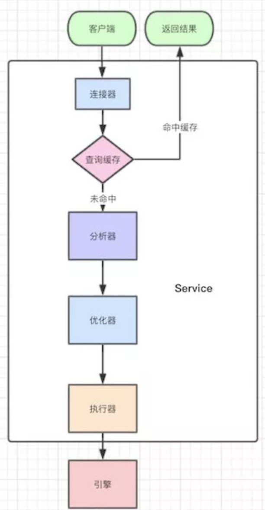
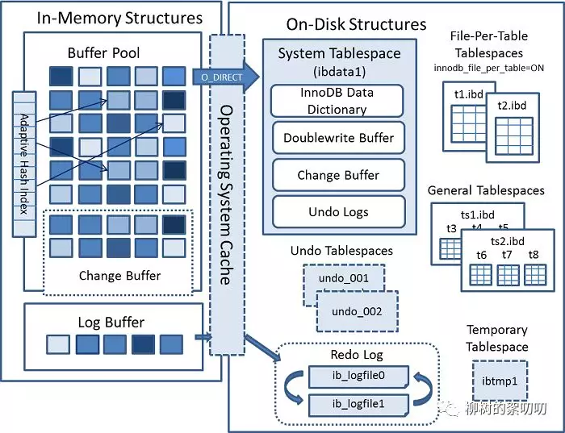
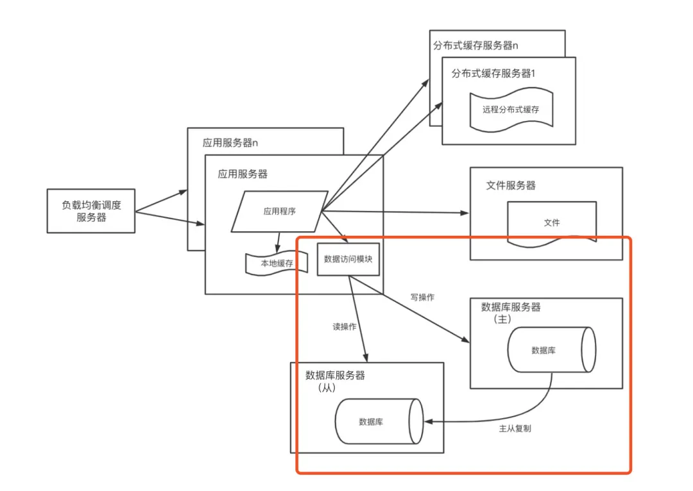
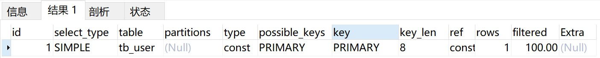
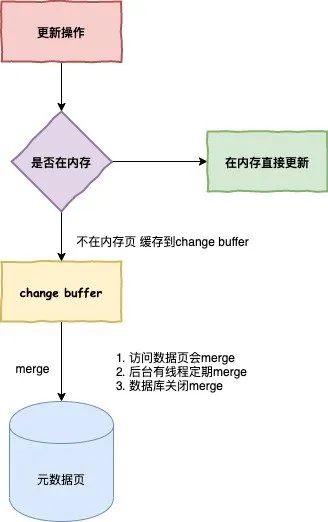
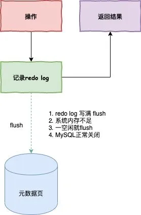

# 基础

### 多表联查

内连接
* 隐式
* 显示

外连接
* 左外连接
* 右外连接

### 执行顺序
> from->where->group by->子句->计算表达式->select->排序

1、from 子句组装来自不同数据源的数据；

2、where 子句基于指定的条件对记录行进行筛选；

3、group by 子句将数据划分为多个分组；

4、使用聚集函数进行计算；

5、使用 having 子句筛选分组；

6、计算所有的表达式；

7、select 的字段；

8、使用 order by 对结果集进行排序。

### 三大范式

关系数据库设计理论

函数依赖

记 A->B 表示 A 函数决定 B，也可以说 B 函数依赖于 A。

如果 {A1，A2，... ，An} 是关系的一个或多个属性的集合，该集合函数决定了关系的其它所有属性并且是最小的，那么该集合就称为键码。

对于 A->B，如果能找到 A 的真子集 A'，使得 A'-> B，那么 A->B 就是部分函数依赖，否则就是完全函数依赖。

对于 A->B，B->C，则 A->C 是一个传递函数依赖

##### 异常

以下的学生课程关系的函数依赖为 {Sno, Cname} -> {Sname, Sdept, Mname, Grade}，键码为 {Sno, Cname}。也就是说，确定学生和课程之后，就能确定其它信息。

| Sno  | Sname  | Sdept  | Mname  | Cname  | Grade |
| :--: | :----: | :----: | :----: | :----: | :---: |
|  1   | 学生-1 | 学院-1 | 院长-1 | 课程-1 |  90   |
|  2   | 学生-2 | 学院-2 | 院长-2 | 课程-2 |  80   |
|  2   | 学生-2 | 学院-2 | 院长-2 | 课程-1 |  100  |
|  3   | 学生-3 | 学院-2 | 院长-2 | 课程-2 |  95   |

不符合范式的关系，会产生很多异常，主要有以下四种异常：

-   冗余数据：例如 `学生-2` 出现了两次。
-   修改异常：修改了一个记录中的信息，但是另一个记录中相同的信息却没有被修改。
-   删除异常：删除一个信息，那么也会丢失其它信息。例如删除了 `课程-1` 需要删除第一行和第三行，那么 `学生-1` 的信息就会丢失。
-   插入异常：例如想要插入一个学生的信息，如果这个学生还没选课，那么就无法插入。

范式理论是为了解决以上提到四种异常。

高级别范式的依赖于低级别的范式，1NF 是最低级别的范式。

##### 第一范式（1NF)

属性不可分。

##### 第二范式（2NF）

每个非主属性完全函数依赖于键码。

可以通过分解来满足。

**分解前**

| Sno  | Sname  | Sdept  | Mname  | Cname  | Grade |
| :--: | :----: | :----: | :----: | :----: | :---: |
|  1   | 学生-1 | 学院-1 | 院长-1 | 课程-1 |  90   |
|  2   | 学生-2 | 学院-2 | 院长-2 | 课程-2 |  80   |
|  2   | 学生-2 | 学院-2 | 院长-2 | 课程-1 |  100  |
|  3   | 学生-3 | 学院-2 | 院长-2 | 课程-2 |  95   |

以上学生课程关系中，{Sno, Cname} 为键码，有如下函数依赖：

-   Sno -> Sname, Sdept
-   Sdept -> Mname
-   Sno, Cname-> Grade

Grade 完全函数依赖于键码，它没有任何冗余数据，每个学生的每门课都有特定的成绩。

Sname, Sdept 和 Mname 都部分依赖于键码，当一个学生选修了多门课时，这些数据就会出现多次，造成大量冗余数据。

**分解后**

关系-1

| Sno  | Sname  | Sdept  | Mname  |
| :--: | :----: | :----: | :----: |
|  1   | 学生-1 | 学院-1 | 院长-1 |
|  2   | 学生-2 | 学院-2 | 院长-2 |
|  3   | 学生-3 | 学院-2 | 院长-2 |

有以下函数依赖：

-   Sno -> Sname, Sdept
-   Sdept -> Mname

关系-2

| Sno  | Cname  | Grade |
| :--: | :----: | :---: |
|  1   | 课程-1 |  90   |
|  2   | 课程-2 |  80   |
|  2   | 课程-1 |  100  |
|  3   | 课程-2 |  95   |

有以下函数依赖：

-   Sno, Cname ->  Grade

##### 第三范式 (3NF)

非主属性不传递函数依赖于键码。

上面的 关系-1 中存在以下传递函数依赖：

-   Sno -> Sdept -> Mname

可以进行以下分解：

关系-11

| Sno  | Sname  | Sdept  |
| :--: | :----: | :----: |
|  1   | 学生-1 | 学院-1 |
|  2   | 学生-2 | 学院-2 |
|  3   | 学生-3 | 学院-2 |

关系-12

| Sdept  | Mname  |
| :----: | :----: |
| 学院-1 | 院长-1 |
| 学院-2 | 院长-2 |


# 存储引擎
MySQL架构图：

## 连接器
我们要进行查询，第一步就是先去链接数据库，那这个时候就是连接器跟我们对接。

他负责跟客户端建立链接、获取权限、维持和管理连接。

链接的时候会经过TCP握手，然后身份验证，然后我们输入用户名密码就好了。

验证ok后，我们就连上了这个MySQL服务了，但是这个时候我们处于空闲状态。
### 空闲连接
show processlist：Command列显示为Sleep的这一行，就表示现在系统里面有一个空闲连接。
> 数据库的客户端太久没响应，连接器就会自动断开了，这个时间参数是wait_timeout控制住的，默认时长为8小时。断开后重连的时候会报错，如果你想再继续操作，你就需要重连了。

解决方案：
* 重新连接
* 使用长连接

长连接的问题：
* 使用长连接之后，内存会飙得很快，MySQL在执行过程中临时使用的内存是管理在连接对象里面的。只有在连接断开的时候才能得到释放，那如果一直使用长连接，那就会导致OOM（Out Of Memory），会导致MySQL重启，在JVM里面就会导致频繁的Full GC。

解决方案：
* 定期断开长连接，使用一段时间后，或者程序里面判断执行过一个占用内存比较大的查询后就断开连接，需要的时候重连就好了。
* 执行比较大的一个查询后，执行mysql_reset_connection可以重新初始化连接资源。这个过程相比上面一种会好点，不需要重连，但是会初始化连接的状态。

## 查询缓存
MySQL拿到一个查询请求后，会先到查询缓存看看，之前是不是执行过这条语句。

同一条语句在MySQL执行两次，第一次和后面的时间是不一样的，后者明显快一些，这就是因为缓存的存在。

跟Redis一样，只要是你之前执行过的语句，都会在内存里面用key-value形式存储着。

查询的时候就会拿着语句先去缓存中查询，如果能够命中就返回缓存的value，如果不命中就执行后面的阶段。

### 缓存利大于弊
缓存的失效很容易，只要对表有任何的更新，这个表的所有查询缓存就会全部被清空，就会出现缓存还没使用，就直接被清空了，或者积累了很多缓存准备用来着，但是一个更新打回原形。

这就导致查询的命中率低的可怕，只有那种只查询不更新的表适用缓存，但是这样的表往往很少存在，一般都是什么配置表之类的。

### 不用缓存的操作
显示调用，把query_cache_type设置成为DEMAND，这样SQL默认不适用缓存，想用缓存就用SQL_CACHE。

看sql执行时间，但是可能是有缓存的，一般我们就在sql前面使用SQL_NO_CACHE就可以知道真正的查询时间了。
```sql
select SQL_NO_CACHE * from A
```

## 分析器
在缓存没有命中的情况下，就开始执行语句了，检查SQL语句是否有问题，先做词法分析（语句有这么多单词、空格，MySQL就需要识别每个字符串所代表的是什么，是关键字，还是表名，还是列名等等。），然后语法分析（根据词法分析的结果，语法分析会判断你sql的对错，错了会提醒你的，并且会提示你哪里错了。）

## 优化器
分析无误后就进入优化器，优化的东西主要是：确认使用哪一个索引，使用你的主键索引，联合索引还是什么索引更好。；对执行顺序优化，条件那么多，先查哪个表，还是先关联，会出现很多方案，最后由优化器决定选用哪种方案。

## 执行器
优化后就执行了，第一步做权限的判断；执行的时候，就一行一行的去判断是否满足条件，有索引的执行起来可能就好点，一行行的判断就像是接口都提前在引擎定义好了，所以比较快。

## InnoDB
### InnoDB内存架构
InnoDB内存架构图：

两大块：
* InnoDB In-Memory Structures（内存）
* InnoDB On-Disk Structures（磁盘）

#### 内存
##### Buffer Pool
> The buffer pool is an area in main memory where InnoDB caches table and index data as it is accessed.

MySQL 不会直接去修改磁盘的数据，因为这样做太慢了，MySQL 会先改内存，然后记录 redo log，等有空了再刷磁盘，如果内存里没有数据，就去磁盘 load。

这些数据存放的地方，就是 Buffer Pool。

平时开发时，会用 redis 来做缓存，缓解数据库压力，其实 MySQL 自己也做了一层类似缓存的东西。

MySQL 是以「页」（page）为单位从磁盘读取数据的，Buffer Pool 里的数据也是如此，实际上，Buffer Pool 是a linked list of pages，一个以页为元素的链表。

为什么是链表？因为和缓存一样，它也需要一套淘汰算法来管理数据。

Buffer Pool 采用基于 LRU（least recently used） 的算法来管理内存

##### Change Buffer
如果内存里没有对应「页」的数据，MySQL 就会去把数据从磁盘里 load 出来，如果每次需要的「页」都不同，或者不是相邻的「页」，那么每次 MySQL 都要去 load，这样就很慢了。

于是如果 MySQL 发现你要修改的页，不在内存里，就把你要对页的修改，先记到一个叫 Change Buffer 的地方，同时记录 redo log，然后再慢慢把数据 load 到内存，load 过来后，再把 Change Buffer 里记录的修改，应用到内存（Buffer Pool）中，这个动作叫做 merge；而把内存数据刷到磁盘的动作，叫 purge：

merge：Change Buffer -> Buffer Pool
purge：Buffer Pool -> Disk


InnoDB 是 MySQL 默认的事务型存储引擎，只要在需要它不支持的特性时，才考虑使用其他存储引擎。

InnoDB 采用 MVCC 来支持高并发，并且实现了四个标准隔离级别(未提交读、提交读、可重复读、可串行化)。其默认级别时可重复读（REPEATABLE READ），在可重复读级别下，通过 MVCC + Next-Key Locking 防止幻读。

主索引时聚簇索引，在索引中保存了数据，从而避免直接读取磁盘，因此对主键查询有很高的性能。

InnoDB 内部做了很多优化，包括从磁盘读取数据时采用的可预测性读，能够自动在内存中创建 hash 索引以加速读操作的自适应哈希索引，以及能够加速插入操作的插入缓冲区等。

InnoDB 支持真正的在线热备份，MySQL 其他的存储引擎不支持在线热备份，要获取一致性视图需要停止对所有表的写入，而在读写混合的场景中，停止写入可能也意味着停止读取。

## MyISAM

设计简单，数据以紧密格式存储。对于只读数据，或者表比较小、可以容忍修复操作，则依然可以使用它。

提供了大量的特性，包括压缩表、空间数据索引等。

不支持事务。

不支持行级锁，只能对整张表加锁，读取时会对需要读到的所有表加共享锁，写入时则对表加排它锁。但在表有读取操作的同时，也可以往表中插入新的记录，这被称为并发插入（CONCURRENT INSERT）。

可以手工或者自动执行检查和修复操作，但是和事务恢复以及崩溃恢复不同，可能导致一些数据丢失，而且修复操作是非常慢的。

如果指定了 DELAY_KEY_WRITE 选项，在每次修改执行完成时，不会立即将修改的索引数据写入磁盘，而是会写到内存中的键缓冲区，只有在清理键缓冲区或者关闭表的时候才会将对应的索引块写入磁盘。这种方式可以极大的提升写入性能，但是在数据库或者主机崩溃时会造成索引损坏，需要执行修复操作。

## InnoDB 和 MyISAM 的比较

*   事务：InnoDB 是事务型的，可以使用 Commit 和 Rollback 语句。
*   并发：MyISAM 只支持表级锁，而 InnoDB 还支持行级锁。
*   外键：InnoDB 支持外键。
*   备份：InnoDB 支持在线热备份。
*   崩溃恢复：MyISAM 崩溃后发生损坏的概率比 InnoDB 高很多，而且恢复的速度也更慢。
*   其它特性：MyISAM 支持压缩表和空间数据索引。


# 索引

> 索引其实是一种数据结构，能够帮助我们快速的检索数据库中的数据

## 数据结构：
常见的MySQL主要有两种结构：Hash索引和B+ Tree索引，我们使用的是InnoDB引擎，默认的是B+树

### Hash

>   通过哈希字段值隐射到不同位置

特点：

>   **可以快速的精确查询，但是不支持范围查询**。

适用场景：

>   等值查询的场景，就只有KV（Key，Value）的情况

InnoDB 存储引擎有一个特殊的功能叫“自适应哈希索引”，当某个索引值被使用的非常频繁时，会在 B+Tree 索引之上再创建一个哈希索引，这样就让 B+Tree 索引具有哈希索引的一些优点，比如快速的哈希查找。

#### 有序的数据结构？

在等值查询的和范围查询的时候都很好，适合静态数据（去年的支付宝账单/去年购物记录），如果我们新增、删除、修改数据的时候就会改变他的结构，比如你新增一个，那在你新增的位置后面所有的节点都会后移，成本很高


### B+树

最开始的Hash不支持范围查询，二叉树树高很高，只有B树跟B+有的一比。

B树一个节点可以存储多个元素，相对于完全平衡二叉树整体的树高降低了，磁盘IO效率提高了。

而B+树是B树的升级版，只是把非叶子节点冗余一下，这么做的好处是**为了提高范围查找的效率**。（有指针指向下一个节点的叶子节点。）

#### 二叉树？

二叉树是有序的，所以是支持范围查询的。它的时间复杂度是O(log(N))，为了维持这个时间复杂度，更新的时间复杂度也得是O(log(N))，那就得保持这棵树是完全平衡二叉树了。

缺点：

>   如果数据多了，树高会很高，查询的成本就会随着树高的增加而增加。

#### B树？

同样的元素，B树的表示要比完全平衡二叉树要“矮”，原因在于B树中的一个节点可以存储多个元素。


#### B+树节点元素个数？

B+树中一个节点为一页或页的倍数最为合适

因为如果一个节点的大小小于1页，那么读取这个节点的时候其实也会读出1页，造成资源的浪费。

如果一个节点的大小大于1页，比如1.2页，那么读取这个节点的时候会读出2页，也会造成资源的浪费。

所以为了不造成浪费，所以最后把一个节点的大小控制在1页、2页、3页、4页等倍数页大小最为合适。

#### 各种树

**AVL 树**

平衡二叉树，一般是用平衡因子差值决定并通过旋转来实现，左右子树树高差不超过1，那么和红黑树比较它是严格的平衡二叉树，平衡条件非常严格（树高差只有1），只要插入或删除不满足上面的条件就要通过旋转来保持平衡。由于旋转是非常耗费时间的。所以 AVL 树适用于插入/删除次数比较少，但查找多的场景。

**红黑树**

通过对从根节点到叶子节点路径上各个节点的颜色进行约束，确保没有一条路径会比其他路径长2倍，因而是近似平衡的。所以相对于严格要求平衡的AVL树来说，它的旋转保持平衡次数较少。适合，查找少，插入/删除次数多的场景。（现在部分场景使用跳表来替换红黑树，可搜索“为啥 redis 使用跳表(skiplist)而不是使用 red-black？”）

**B/B+ 树**

多路查找树，出度高，磁盘IO低，一般用于数据库系统中。

##### B + 树与红黑树的比较

红黑树等平衡树也可以用来实现索引，但是文件系统及数据库系统普遍采用 B+ Tree 作为索引结构，主要有以下两个原因：

（一）磁盘 IO 次数

B+ 树一个节点可以存储多个元素，相对于红黑树的树高更低，磁盘 IO 次数更少。

（二）磁盘预读特性

为了减少磁盘 I/O 操作，磁盘往往不是严格按需读取，而是每次都会预读。预读过程中，磁盘进行顺序读取，顺序读取不需要进行磁盘寻道。每次会读取页的整数倍。

操作系统一般将内存和磁盘分割成固定大小的块，每一块称为一页，内存与磁盘以页为单位交换数据。数据库系统将索引的一个节点的大小设置为页的大小，使得一次 I/O 就能完全载入一个节点。


## 索引分类（逻辑）
### 聚簇索引：
主键索引，索引B+ Tree的叶子节点存储了整行数据

InnoDB 的表必定是有一个主键索引（聚簇索引）的，即使不指定某个字段为主键，表结构中也会一个row_id字段来充当聚簇索引

聚簇索引的叶子节点存储结构（primary key id）

| 页4   |       |       |
| ----- | ----- | ----- |
| 1     | 2     | 3     |
| name1 | name2 | name3 |
| pwd1  | pwd2  | pwd3  |


### 二级索引（非聚簇索引）：
非主键索引

叶子节点存储结构（name）：

| 页6   |       |       |
| ----- | ----- | ----- |
| name1 | name2 | name3 |
| 1     | 2     | 3     |

存储内容：

二级索引叶子节点存储的是索引字段和主键字段。

#### 回表

>   当使用二级索引无法得到所需的字段时，先拿到id的信息，然后到聚簇索引中根据id查找

使用覆盖索引

选择查询字段，少用select *

### 覆盖索引

```sql
select * from table where name = 'yks43'
```


select * ，查询所有的，我们如果只查询ID那，其实在Name字段的索引上就已经有了，那就不需要回表了。

覆盖索引可以减少树的搜索次数，提升性能

### 联合索引

多字段索引

创建联合索引时，根据业务需求，where字句中使用最频繁的一列放在最左边，因为MySQL索引查询会遵循最左前缀匹配的原则，即最左优先

#### 最左匹配原则

-   索引可以简单如一个列 (a)，也可以复杂如多个列 (a,b,c,d)，即联合索引。
-   如果是联合索引，那么key也由多个列组成，同时，索引只能用于查找key是否**存在（相等）**，遇到范围查询 (>、<、between、like左匹配)等就**不能进一步匹配**了，后续退化为线性查找。
-   因此，**列的排列顺序决定了可命中索引的列数**。

*   使用like模糊查询时，前缀模糊匹配会导致联合索引无法使用，后缀模糊匹配则可以使用

*   使用or时，有时会走索引，有时不会走索引，优化器会分析走了几次索引，有没有回表，并与全表扫描的效率对比，然后进行选择

#### 索引下推

```sql
select * from user where name like '喻%' and size=22 and age = 20;
```

这个语句在搜索索引树的时候，只能用 “喻”，找到第一个满足条件的记录ID1，当然，这还不错，总比全表扫描要好。然后判断其他条件是否满足，在MySQL 5.6之前，只能从ID1开始一个个回表，到主键索引上找出数据行，再对比字段值。而MySQL 5.6 引入的索引下推优化（index condition pushdown)， 可以在索引遍历过程中，对索引中包含的字段先做判断，直接过滤掉不满足条件的记录，减少回表次数。


##### 配置
索引下推优化是默认开启的。可以通过下面的脚本控制开关
```sql
SET optimizer_switch = 'index_condition_pushdown=off'; 
SET optimizer_switch = 'index_condition_pushdown=on';
```

##### 思考
索引下推优化技术其实就是充分利用了索引中的数据，尽量在查询出整行数据之前过滤掉无效的数据。

由于需要存储引擎将索引中的数据与条件进行判断，所以这个技术是基于存储引擎的，只有特定引擎可以使用。并且判断条件需要是在存储引擎这个层面可以进行的操作才可以，比如调用存储过程的条件就不可以，因为存储引擎没有调用存储过程的能力。


### 全文索引

MyISAM 存储引擎支持全文索引，用于查找文本中的关键词，而不是直接比较是否相等。

查找条件使用 MATCH AGAINST，而不是普通的 WHERE。

全文索引使用倒排索引实现，它记录着关键词到其所在文档的映射。

InnoDB 存储引擎在 MySQL 5.6.4 版本中也开始支持全文索引。

### 空间数据索引

MyISAM 存储引擎支持空间数据索引（R-Tree），可以用于地理数据存储。空间数据索引会从所有维度来索引数据，可以有效地使用任意维度来进行组合查询。

必须使用 GIS 相关的函数来维护数据。

## 基础知识

##### 页

储存结构：页（记录都存在页里面）：


* 各个数据页可以组成一个双向链表
* 而每个数据页中的记录又可以组成一个单向链表
    * 每个数据页都会为存储在它里边儿的记录生成一个页目录，在通过主键查找某条记录的时候可以在页目录中使用二分法快速定位到对应的槽，然后再遍历该槽对应分组中的记录即可快速找到指定的记录
    * 以其他列(非主键)作为搜索条件：只能从最小记录开始依次遍历单链表中的每条记录。

所以说，如果我们写 `select * from user where username='yks43'`这样没有进行任何优化的sql语句，默认会这样做：
* 定位到记录所在的页
    * 需要遍历双向链表，找到所在的页
* 从所在的页内中查找相应的记录
    * 由于不是根据主键查询，只能遍历所在页的单链表了

很明显，在数据量很大的情况下这样查找会很慢！


# explain

使用 explain 分析 select 查询语句

>   explain 用来分析 SELECT 查询语句，可以通过分析 Explain 结果来优化查询语句。

### select_type

常用的有 SIMPLE 简单查询，UNION 联合查询，SUBQUERY 子查询等。

### table

要查询的表

### possible_keys

>   The possible indexes to choose

可选择的索引

### key

>   The index actually chosen

实际使用的索引

### rows

>   Estimate of rows to be examined

扫描的行数

### type

索引查询类型，经常用到的索引查询类型：

*   const：使用主键或者唯一索引进行查询的时候只有一行匹配 

*   ref：使用非唯一索引 

*   range：使用主键、单个字段的辅助索引、多个字段的辅助索引的最后一个字段进行范围查询 

*   index：和all的区别是扫描的是索引树 

*   all：扫描全表：

#### system

触发条件：表只有一行，这是一个 const type 的特殊情况

#### const

触发条件：在使用主键或者唯一索引进行查询的时候只有一行匹配。

#### eq_ref

触发条件：在进行联接查询的，使用主键或者唯一索引并且只匹配到一行记录的时候

#### ref

触发条件：使用非唯一索引

#### range

触发条件：只有在使用主键、单个字段的辅助索引、多个字段的辅助索引的最后一个字段进行范围查询才是 range

#### index

触发条件：

只扫描索引树

1.  查询的字段是索引的一部分，覆盖索引。
2.  使用主键进行排序

#### all

触发条件：全表扫描，不走索引

## 优化数据访问

### 减少请求的数据量

*   只返回必要的列：最好不要使用 SELECT * 语句。
*   只返回必要的行：使用 LIMIT 语句来限制返回的数据。
*   缓存重复查询的数据：使用缓存可以避免在数据库中进行查询，特别在要查询的数据经常被重复查询时，缓存带来的查询性能提升将会是非常明显的。

### 减少服务器端扫描的行数

最有效的方式是使用索引来覆盖查询。

# 事务

>   事务是指满足 ACID 特性的一组操作，可以通过 Commit 提交一个事务，也可以使用 Rollback 进行回滚。

### ACID

事务最基本的莫过于 ACID 四个特性了，这四个特性分别是：

-   Atomicity：原子性
-   Consistency：一致性
-   Isolation：隔离性
-   Durability：持久性

**原子性**

事务被视为不可分割的最小单元，事务的所有操作要么全部成功，要么全部失败回滚。

**一致性**

数据库在事务执行前后都保持一致性状态，在一致性状态下，所有事务对一个数据的读取结果都是相同的。

**隔离性**

一个事务所做的修改在最终提交以前，对其他事务是不可见的。

**持久性**

一旦事务提交，则其所做的修改将会永远保存到数据库中。即使系统发生崩溃，事务执行的结果也不能丢。

#### ACID之间的关系

事务的 ACID 特性概念很简单，但不好理解，主要是因为这几个特性不是一种平级关系：

-   只有满足一致性，事务的结果才是正确的。
-   在无并发的情况下，事务串行执行，隔离性一定能够满足。此时只要能满足原子性，就一定能满足一致性。在并发的情况下，多个事务并行执行，事务不仅要满足原子性，还需要满足隔离性，才能满足一致性。
-   事务满足持久化是为了能应对数据库崩溃的情况。

### 隔离级别

**未提交读（READ UNCOMMITTED）**

事务中的修改，即使没有提交，对其他事务也是可见的。

**提交读（READ COMMITTED）**

一个事务只能读取已经提交的事务所做的修改。换句话说，一个事务所做的修改在提交之前对其他事务是不可见的。

**可重复读（REPEATABLE READ）**

保证在同一个事务中多次读取同样数据的结果是一样的。

**可串行化（SERIALIZABLE）**

强制事务串行执行。

需要加锁实现，而其它隔离级别通常不需要。

| 隔离级别 | 脏读 | 不可重复读 | 幻影读 |
| :------: | :--: | :--------: | :----: |
| 未提交读 |  √   |     √      |   √    |
|  提交读  |  ×   |     √      |   √    |
| 可重复读 |  ×   |     ×      |   √    |
| 可串行化 |  ×   |     ×      |   ×    |

# 锁

>   锁机制用于管理对共享资源的并发访问。


## 为什么要学习锁
即使我们不会这些锁知识，我们的程序在一般情况下还是可以跑得好好的。因为这些锁数据库隐式帮我们加了
* 对于 UPDATE、DELETE、INSERT语句，InnoDB会自动给涉及数据集加排他锁（X)
* MyISAM在执行查询语句 SELECT前，会自动给涉及的所有表加读锁，在执行更新操作（ UPDATE、DELETE、INSERT等）前，会自动给涉及的表加写锁，这个过程并不需要用户干预

只会在某些特定的场景下才需要手动加锁，学习数据库锁知识就是为了:
* 能让我们在特定的场景下派得上用场
* 更好把控自己写的程序
* 构建自己的知识库体系！在面试的时候不虚


## 锁分类

### 从锁的粒度角度：

-   **表锁**

-   -   开销小，加锁快；不会出现死锁；锁定力度大，发生锁冲突概率高，并发度最低

-   **行锁**

-   -   开销大，加锁慢；会出现死锁；锁定粒度小，发生锁冲突的概率低，并发度高

不同的存储引擎支持的锁粒度是不一样的：

-   **InnoDB行锁和表锁都支持**！
-   **MyISAM只支持表锁**！

InnoDB只有通过**索引条件**检索数据**才使用行级锁**，否则，InnoDB将使用**表锁**

-   也就是说，**InnoDB的行锁是基于索引的**！

**表锁下又分为两种模式**：

-   表读锁（Table Read Lock）

-   表写锁（Table Write Lock）

-   从下图可以清晰看到，在表读锁和表写锁的环境下：**读读不阻塞，读写阻塞，写写阻塞**！

-   -   读读不阻塞：当前用户在读数据，其他的用户也在读数据，不会加锁
    -   读写阻塞：当前用户在读数据，其他的用户**不能修改当前用户读的数据**，会加锁！
    -   写写阻塞：当前用户在修改数据，其他的用户**不能修改当前用户正在修改的数据**，会加锁！


从上面已经看到了：**读锁和写锁是互斥的，读写操作是串行**。

-   如果某个进程想要获取读锁，**同时**另外一个进程想要获取写锁。在mysql里边，**写锁是优先于读锁的**！
-   写锁和读锁优先级的问题是可以通过参数调节的： `max_write_lock_count`和 `low-priority-updates`

值得注意的是：

>   The LOCAL modifier enables nonconflicting INSERT statements (concurrent inserts) by other sessions to execute while the lock is held. (See Section 8.11.3, “Concurrent Inserts”.) However, READ LOCAL cannot be used if you are going to manipulate the database using processes external to the server while you hold the lock. **For InnoDB tables, READ LOCAL is the same as READ**

-   **MyISAM可以**支持查询和插入操作的**并发**进行。可以通过系统变量 `concurrent_insert`来指定哪种模式，在**MyISAM**中它默认是：如果MyISAM表中没有空洞（即表的中间没有被删除的行），MyISAM允许在一个进程读表的同时，另一个进程从**表尾**插入记录。
-   但是**InnoDB存储引擎是不支持的**！

#### 行锁细讲

上边简单讲解了表锁的相关知识，我们使用Mysql一般是使用InnoDB存储引擎的。InnoDB和MyISAM有两个本质的区别：

-   InnoDB支持行锁
-   InnoDB支持事务

从上面也说了：我们是**很少手动加表锁**的。表锁对我们程序员来说几乎是透明的，即使InnoDB不走索引，加的表锁也是自动的！

我们应该**更加关注行锁的内容**，因为InnoDB一大特性就是支持行锁！

InnoDB实现了以下**两种**类型的行锁。

-   共享锁（S锁）：允许一个事务去读一行，阻止其他事务获得相同数据集的排他锁。

-   -   也叫做**读锁**：读锁是**共享**的，多个客户可以**同时读取同一个**资源，但**不允许其他客户修改**。

-   排他锁（X锁)：允许获得排他锁的事务更新数据，阻止其他事务取得相同数据集的共享读锁和排他写锁。

-   -   也叫做**写锁**：写锁是排他的，**写锁会阻塞其他的写锁和读锁**。

看完上面的有没有发现，在一开始所说的：X锁，S锁，读锁，写锁，共享锁，排它锁其实**总共就两个锁**，只不过它们**有多个名字罢了**~~~

>   Intention locks do not block anything except full table requests (for example, LOCK TABLES ... WRITE). The main purpose of intention locks **is to show that someone is locking a row, or going to lock a row in the table**.

另外，**为了允许行锁和表锁共存，实现多粒度锁机制**，InnoDB还有两种内部使用的意向锁（Intention Locks），这两种意向锁都是**表锁**：

-   意向共享锁（IS）：事务打算给数据行加行共享锁，事务在给一个数据行加共享锁前必须先取得该表的IS锁。
-   意向排他锁（IX）：事务打算给数据行加行排他锁，事务在给一个数据行加排他锁前必须先取得该表的IX锁。
-   意向锁也是数据库隐式帮我们做了，**不需要程序员操心**！

##### MVCC和事务的隔离级别

数据库事务有不同的隔离级别，不同的隔离级别对锁的使用是不同的，**锁的应用最终导致不同事务的隔离级别**

MVCC(Multi-Version Concurrency Control)多版本并发控制，可以简单地认为：**MVCC就是行级锁的一个变种(升级版)**。

-   事务的隔离级别就是**通过锁的机制来实现**，只不过**隐藏了加锁细节**

在**表锁中我们读写是阻塞**的，基于提升并发性能的考虑，**MVCC一般读写是不阻塞的**(所以说MVCC很多情况下避免了加锁的操作)

-   MVCC实现的**读写不阻塞**正如其名：**多版本**并发控制--->通过一定机制生成一个数据请求**时间点的一致性数据快照（Snapshot)**，并用这个快照来提供一定级别（**语句级或事务级**）的**一致性读取**。从用户的角度来看，好像是**数据库可以提供同一数据的多个版本**。

快照有**两个级别**：

-   语句级

-   -   针对于 `Readcommitted`隔离级别

-   事务级别

-   -   针对于 `Repeatableread`隔离级别

我们在初学的时候已经知道，事务的隔离级别有**4种**：

-   Read uncommitted

-   -   会出现脏读，不可重复读，幻读

-   Read committed

-   -   会出现不可重复读，幻读

-   Repeatable read

-   -   会出现幻读(但在Mysql实现的Repeatable read配合gap锁不会出现幻读！)

-   Serializable

-   -   串行，避免以上的情况！

------

`Readuncommitted`会出现的现象--->脏读：**一个事务读取到另外一个事务未提交的数据**

-   例子：A向B转账，**A执行了转账语句，但A还没有提交事务，B读取数据，发现自己账户钱变多了**！B跟A说，我已经收到钱了。A回滚事务【rollback】，等B再查看账户的钱时，发现钱并没有多。
-   出现脏读的原因是因为在读的时候**没有加读锁**，导致可以**读取出还没释放锁的记录**。

`Readuncommitted`过程：

-   事务A读取记录(没有加任何的锁)
-   事务B修改记录(此时加了写锁，并且还没有commit-->也就没有释放掉写锁)
-   事务A再次读取记录(此时因为事务A在读取时没有加任何锁，所以可以读取到事务B还没提交的(没释放掉写锁)的记录

------

`Readcommitted`**避免脏读**的做法其实很简单：

-   **在读取的时候生成一个版本号，直到事务其他commit被修改了之后，才会有新的版本号**

`Readcommitted`过程：

-   事务A读取了记录(生成版本号)
-   事务B修改了记录(此时加了写锁)
-   事务A再读取的时候，**是依据最新的版本号来读取的**(当事务B执行commit了之后，会生成一个新的版本号)，如果事务B还没有commit，那事务A读取的还是之前版本号的数据。

但 `Readcommitted`出现的现象--->不可重复读：**一个事务读取到另外一个事务已经提交的数据，也就是说一个事务可以看到其他事务所做的修改**

-   注：**A查询数据库得到数据，B去修改数据库的数据，导致A多次查询数据库的结果都不一样【危害：A每次查询的结果都是受B的影响的，那么A查询出来的信息就没有意思了】**

------

上面也说了， `Readcommitted`是**语句级别**的快照！**每次读取的都是当前最新的版本**！

`Repeatableread`避免不可重复读是**事务级别**的快照！每次读取的都是当前事务的版本，即使被修改了，也只会读取当前事务版本的数据。

呃...如果还是不太清楚，我们来看看InnoDB的MVCC是怎么样的吧(摘抄《高性能MySQL》)


至于虚读(幻读)：**是指在一个事务内读取到了别的事务插入的数据，导致前后读取不一致。**

-   注：**和不可重复读类似，但虚读(幻读)会读到其他事务的插入的数据，导致前后读取不一致**

-   ### MySQL的 `Repeatableread`隔离级别加上GAP间隙锁**已经处理了幻读了**。

### 乐观锁和悲观锁

无论是 `Readcommitted`还是 `Repeatableread`隔离级别，都是为了解决**读写冲突**的问题。

单纯在 `Repeatableread`隔离级别下我们来考虑一个问题：


此时，用户李四的操作就丢失掉了：

-   **丢失更新**：一个事务的更新**覆盖了其它事务的更新结果**。

(ps:暂时没有想到比较好的例子来说明更新丢失的问题，虽然上面的例子也是更新丢失，但**一定程度上是可接受的**..不知道有没有人能想到不可接受的更新丢失例子呢...)

解决的方法：

-   使用Serializable隔离级别，事务是串行执行的！
-   乐观锁
-   悲观锁

>   1.  乐观锁是一种思想，具体实现是，表中有一个版本字段，第一次读的时候，获取到这个字段。处理完业务逻辑开始更新的时候，需要再次查看该字段的值是否和第一次的一样。如果一样更新，反之拒绝。之所以叫乐观，因为这个模式没有从数据库加锁，等到更新的时候再判断是否可以更新。
>   2.  悲观锁是数据库层面加锁，都会阻塞去等待锁。


##### 悲观锁

所以，按照上面的例子。我们使用悲观锁的话其实很简单(手动加行锁就行了)：

-   `select*fromxxxxforupdate`

在select 语句后边加了 `forupdate`相当于加了排它锁(写锁)，加了写锁以后，其他的事务就不能对它修改了！需要等待当前事务修改完之后才可以修改.

-   也就是说，如果张三使用 `select...forupdate`，李四就无法对该条记录修改了~

##### 乐观锁

乐观锁不是数据库层面上的锁，是需要自己手动去加的锁。一般我们添加一个版本字段来实现：

具体过程是这样的：

张三 `select*fromtable` --->会查询出记录出来，同时会有一个version字段


李四 `select*fromtable` --->会查询出记录出来，同时会有一个version字段


李四对这条记录做修改： `update AsetName=lisi,version=version+1whereID=#{id}andversion=#{version}`，判断之前查询到的version与现在的数据的version进行比较，**同时会更新version字段**

此时数据库记录如下：


张三也对这条记录修改： `update AsetName=lisi,version=version+1whereID=#{id}andversion=#{version}`，但失败了！因为**当前数据库中的版本跟查询出来的版本不一致**！


### 间隙锁GAP

当我们**用范围条件检索数据**而不是相等条件检索数据，并请求共享或排他锁时，InnoDB会给**符合范围条件的已有数据记录的索引项加锁**；对于键值在条件范围内但并不存在的记录，叫做“间隙（GAP)”。InnoDB也会对这个“间隙”加锁，这种锁机制就是所谓的间隙锁。

值得注意的是：间隙锁只会在 `Repeatableread`隔离级别下使用~

例子：假如emp表中只有101条记录，其empid的值分别是1,2,...,100,101

```
Select * from  emp where empid > 100 for update;
```

上面是一个范围查询，InnoDB**不仅**会对符合条件的empid值为101的记录加锁，也会对**empid大于101（这些记录并不存在）的“间隙”加锁**。

InnoDB使用间隙锁的目的有两个：

-   **为了防止幻读**(上面也说了， `Repeatableread`隔离级别下再通过GAP锁即可避免了幻读)

-   **满足恢复和复制的需要**

-   -   MySQL的恢复机制要求：**在一个事务未提交前，其他并发事务不能插入满足其锁定条件的任何记录，也就是不允许出现幻读**

### 死锁

并发的问题就少不了死锁，在MySQL中同样会存在死锁的问题。

但一般来说MySQL通过回滚帮我们解决了不少死锁的问题了，但死锁是无法完全避免的，可以通过以下的经验参考，来尽可能少遇到死锁：

-   1）以**固定的顺序**访问表和行。比如对两个job批量更新的情形，简单方法是对id列表先排序，后执行，这样就避免了交叉等待锁的情形；将两个事务的sql顺序调整为一致，也能避免死锁。
-   2）**大事务拆小**。大事务更倾向于死锁，如果业务允许，将大事务拆小。
-   3）在同一个事务中，尽可能做到**一次锁定**所需要的所有资源，减少死锁概率。
-   4）**降低隔离级别**。如果业务允许，将隔离级别调低也是较好的选择，比如将隔离级别从RR调整为RC，可以避免掉很多因为gap锁造成的死锁。
-   5）**为表添加合理的索引**。可以看到如果不走索引将会为表的每一行记录添加上锁，死锁的概率大大增大。

## 总结

表锁其实我们程序员是很少关心它的：

-   在MyISAM存储引擎中，当执行SQL语句的时候是自动加的。
-   在InnoDB存储引擎中，如果没有使用索引，表锁也是自动加的。

现在我们大多数使用MySQL都是使用InnoDB，InnoDB支持行锁：

-   共享锁--读锁--S锁
-   排它锁--写锁--X锁

在默认的情况下， `select`是不加任何行锁的~事务可以通过以下语句显示给记录集加共享锁或排他锁。

-   共享锁（S）： `SELECT*FROM table_name WHERE...LOCK IN SHARE MODE`。
-   排他锁（X)： `SELECT*FROM table_name WHERE...FOR UPDATE`。

InnoDB**基于行锁**还实现了MVCC多版本并发控制，MVCC在隔离级别下的 `Readcommitted`和 `Repeatableread`下工作。MVCC能够实现**读写不阻塞**！

InnoDB实现的 `Repeatableread`隔离级别配合GAP间隙锁已经避免了幻读！

-   乐观锁其实是一种思想，正如其名：认为不会锁定的情况下去更新数据，如果发现不对劲，才不更新(回滚)。在数据库中往往添加一个version字段来实现。
-   悲观锁用的就是数据库的行锁，认为数据库会发生并发冲突，直接上来就把数据锁住，其他事务不能修改，直至提交了当前事务

# Log


### 分类

*   undo log
*   binlog
*   redo log

### binlog

##### binlog是什么

>   `binlog`记录了数据库表结构和表数据变更，比如`update/delete/insert/truncate/create`。

##### binlog内容

`binlog`我们可以简单理解为：存储着每条变更的`SQL`语句（当然从下面的图看来看，不止SQL，还有XID「事务Id」等等）


##### binlog作用

>   主要有两个作用：**复制和恢复数据**

*   MySQL在公司使用的时候往往都是**一主多从**结构的，从服务器需要与主服务器的数据保持一致，这就是通过`binlog`来实现的
*   数据库的数据被干掉了，我们可以通过`binlog`来对数据进行恢复。

因为`binlog`记录了数据库表的变更，所以我们可以用`binlog`进行复制（主从复制)和恢复数据。

### redo log

##### 什么是redo log

一条sql语句如下：

```sql
update user_table set name='yks' where id = '43'
```

MySQL执行这条SQL语句，肯定是先把`id=34`的这条记录查出来，然后将`name`字段给改掉。


实际上Mysql的基本存储结构是**页**(记录都存在页里边)，所以MySQL是先把这条记录所在的**页**找到，然后把该页加载到内存中，将对应记录进行修改。

现在就可能存在一个问题：**如果在内存中把数据改了，还没来得及落磁盘，而此时的数据库挂了怎么办**？显然这次更改就丢了。


如果每个请求都需要将数据**立马**落磁盘之后，那速度会很慢，MySQL可能也顶不住。所以MySQL是怎么做的呢？

MySQL引入了`redo log`，内存写完了，然后会写一份`redo log`，这份`redo log`记载着这次**在某个页上做了什么修改**。

如果每个请求都需要将数据**立马**落磁盘之后，那速度会很慢，MySQL可能也顶不住。所以MySQL是怎么做的呢？


MySQL引入了`redo log`，内存写完了，然后会写一份`redo log`，这份`redo log`记载着这次**在某个页上做了什么修改**。


写`redo log`也是需要写磁盘的，但它的好处就是`顺序IO`（我们都知道顺序IO比随机IO快非常多）。

所以，`redo log`的存在为了：当我们修改的时候，写完内存了，但数据还没真正写到磁盘的时候。此时我们的数据库挂了，我们可以根据`redo log`来对数据进行恢复。因为`redo log`是顺序IO，所以**写入的速度很快**，并且`redo log`记载的是物理变化（xxxx页做了xxx修改），文件的体积很小，**恢复速度很快**。


### binlog和redo log的区别

##### 存储内容

`binlog`记载的是`update/delete/insert`这样的SQL语句，而`redo log`记载的是物理修改的内容（xxxx页修改了xxx）。

`redo log` 记录的是数据的**物理变化**，`binlog` 记录的是数据的**逻辑变化**

##### 功能

###### redo log

`redo log`的作用是为**持久化**而生的。写完内存，如果数据库挂了，那我们可以通过`redo log`来恢复内存还没来得及刷到磁盘的数据，将`redo log`加载到内存里边，那内存就能恢复到挂掉之前的数据了。

###### binlog

`binlog`的作用是复制和恢复而生的。

-   主从服务器需要保持数据的一致性，通过`binlog`来同步数据。
-   如果整个数据库的数据都被删除了，`binlog`存储着所有的数据变更情况，那么可以通过`binlog`来对数据进行恢复。

##### binlog和redo log的写入细节

`redo log`是MySQL的InnoDB引擎所产生的。

`binlog`无论MySQL用什么引擎，都会有的。

InnoDB是有事务的，事务的四大特性之一：持久性就是靠`redo log`来实现的（如果写入内存成功，但数据还没真正刷到磁盘，如果此时的数据库挂了，我们可以靠`redo log`来恢复内存的数据，这就实现了持久性）。

上面也提到，在修改的数据的时候，`binlog`会记载着变更的类容，`redo log`也会记载着变更的内容。（只不过一个存储的是物理变化，一个存储的是逻辑变化）。那他们的写入顺序是什么样的呢？

`redo log`**事务开始**的时候，就开始记录每次的变更信息，而`binlog`是在**事务提交**的时候才记录。

于是新有的问题又出现了：我写其中的某一个`log`，失败了，那会怎么办？现在我们的前提是先写`redo log`，再写`binlog`，我们来看看：

-   如果写`redo log`失败了，那我们就认为这次事务有问题，回滚，不再写`binlog`。
-   如果写`redo log`成功了，写`binlog`，写`binlog`写一半了，但失败了怎么办？我们还是会对这次的**事务回滚**，将无效的`binlog`给删除（因为`binlog`会影响从库的数据，所以需要做删除操作）
-   如果写`redo log`和`binlog`都成功了，那这次算是事务才会真正成功。

简单来说：MySQL需要保证`redo log`和`binlog`的**数据是一致**的，如果不一致，那就乱套了。

-   如果`redo log`写失败了，而`binlog`写成功了。那假设内存的数据还没来得及落磁盘，机器就挂掉了。那主从服务器的数据就不一致了。（从服务器通过`binlog`得到最新的数据，而主服务器由于`redo log`没有记载，没法恢复数据）
-   如果`redo log`写成功了，而`binlog`写失败了。那从服务器就拿不到最新的数据了。

MySQL通过**两阶段提交**来保证`redo log`和`binlog`的数据是一致的

过程：

-   阶段1：InnoDB`redo log` 写盘，InnoDB 事务进入 `prepare` 状态
-   阶段2：`binlog` 写盘，InooDB 事务进入 `commit` 状态
-   每个事务`binlog`的末尾，会记录一个 `XID event`，标志着事务是否提交成功，也就是说，恢复过程中，`binlog` 最后一个 XID event 之后的内容都应该被 purge。


### undo log

##### 作用

>   回滚和多版本控制(MVCC)

在数据修改的时候，不仅记录了`redo log`，还记录`undo log`，如果因为某些原因导致事务失败或回滚了，可以用`undo log`进行回滚


`undo log`主要存储的也是逻辑日志，比如我们要`insert`一条数据了，那`undo log`会记录的一条对应的`delete`日志。我们要`update`一条记录时，它会记录一条对应**相反**的update记录。


这也应该容易理解，毕竟回滚嘛，跟需要修改的操作相反就好，这样就能达到回滚的目的。因为支持回滚操作，所以我们就能保证：“**一个事务包含多个操作，这些操作要么全部执行，要么全都不执行**”。【原子性】


因为`undo log`存储着修改之前的数据，相当于一个**前版本**，MVCC实现的是读写不阻塞，读的时候只要返回前一个版本的数据就行了。

# 分库分表

## 水平切分

水平切分又称为 Sharding，它是将同一个表中的记录拆分到多个结构相同的表中。

当一个表的数据不断增多时，Sharding 是必然的选择，它可以将数据分布到集群的不同节点上，从而缓存单个数据库的压力。

### Sharding 策略

*   哈希取模：hash(key)%N
*   范围：可以是 ID 范围也可以是时间范围
*   映射表：使用单独的一个数据库来存储映射关系

### Sharding 存在的问题

**事务问题**

使用分布式事务来解决，比如 XA 接口

**连接**

可以将原来的连接分解成多个单表查询，然后在用户程序中进行连接。

**唯一性**

-   使用全局唯一 ID （GUID）
-   为每个分片指定一个 ID 范围
-   分布式 ID 生成器（如 Twitter 的 Snowflake 算法）

## 垂直切分

垂直切分是将一张表按列分成多个表，通常是按照列的关系密集程度进行切分，也可以利用垂直气氛将经常被使用的列喝不经常被使用的列切分到不同的表中。

在数据库的层面使用垂直切分将按数据库中表的密集程度部署到不通的库中，例如将原来电商数据部署库垂直切分称商品数据库、用户数据库等。

# 主从复制
> 将主数据库的DDL和DML操作通过二进制日志传到从数据库上，然后对这些日志进行重新执行，从而使从数据库和主数据库的数据保持一致

## 原理
* MySql主库在事务提交时会把数据变更作为事件记录在二进制日志Binlog中；
* 主库推送二进制日志文件Binlog中的事件到从库的中继日志Relay Log中，之后从库根据中继日志重做数据变更操作，通过逻辑复制来达到主库和从库的数据一致性；
* MySql通过三个线程来完成主从库间的数据复制，其中Binlog Dump线程跑在主库上，I/O线程和SQL线程跑着从库上；
* 当在从库上启动复制时，首先创建I/O线程连接主库，主库随后创建Binlog Dump线程读取数据库事件并发送给I/O线程，I/O线程获取到事件数据后更新到从库的中继日志Relay Log中去，之后从库上的SQL线程读取中继日志Relay Log中更新的数据库事件并应用

## Docker搭建测试
### 主实例搭建
运行MySQL主实例：
```shell
docker run -p 3307:3306 --name mysql-master \
-v /mydata/mysql-master/log:/var/log/mysql \
-v /mydata/mysql-master/data:/var/lib/mysql \
-v /mydata/mysql-master/conf:/etc/mysql \
-e MYSQL_ROOT_PASSWORD=root  \
-d mysql:5.7
```

在mysql的配置文件夹/mydata/mysql-master/conf中创建一个配置文件my.cnf：
```shell
touch my.cnf
```
修改配置文件my.cnf，配置信息如下：
```cnf
[mysqld]
## 设置server_id，同一局域网中需要唯一
server_id=101
## 指定不需要同步的数据库名称
binlog-ignore-db=mysql
## 开启二进制日志功能
log-bin=mall-mysql-bin
## 设置二进制日志使用内存大小（事务）
binlog_cache_size=1M
## 设置使用的二进制日志格式（mixed,statement,row）
binlog_format=mixed
## 二进制日志过期清理时间。默认值为0，表示不自动清理。
expire_logs_days=7
## 跳过主从复制中遇到的所有错误或指定类型的错误，避免slave端复制中断。
## 如：1062错误是指一些主键重复，1032错误是因为主从数据库数据不一致
slave_skip_errors=1062
```
修改完配置后重启实例，并进入到master容器中，连接到客户端：
```shell
docker restart mysql-master
docker exec -it mysql-master /bin/bash
mysql -uroot -proot
```
创建数据同步用户
```shell
GRANT REPLICATION SLAVE, REPLICATION CLIENT ON *.* TO 'slave'@'%';
```

### 从实例搭建
运行MySQL从实例
```shell
docker run -p 3308:3306 --name mysql-slave \
-v /mydata/mysql-slave/log:/var/log/mysql \
-v /mydata/mysql-slave/data:/var/lib/mysql \
-v /mydata/mysql-slave/conf:/etc/mysql \
-e MYSQL_ROOT_PASSWORD=root  \
-d mysql:5.7
```
在mysql的配置文件夹/mydata/mysql-slave/conf中创建一个配置文件my.cnf，并修改：
```shell
touch my.cnf
```
```cnf
mysqld]
## 设置server_id，同一局域网中需要唯一
server_id=102
## 指定不需要同步的数据库名称
binlog-ignore-db=mysql
## 开启二进制日志功能，以备Slave作为其它数据库实例的Master时使用
log-bin=mall-mysql-slave1-bin
## 设置二进制日志使用内存大小（事务）
binlog_cache_size=1M
## 设置使用的二进制日志格式（mixed,statement,row）
binlog_format=mixed
## 二进制日志过期清理时间。默认值为0，表示不自动清理。
expire_logs_days=7
## 跳过主从复制中遇到的所有错误或指定类型的错误，避免slave端复制中断。
## 如：1062错误是指一些主键重复，1032错误是因为主从数据库数据不一致
slave_skip_errors=1062
## relay_log配置中继日志
relay_log=mall-mysql-relay-bin
## log_slave_updates表示slave将复制事件写进自己的二进制日志
log_slave_updates=1
## slave设置为只读（具有super权限的用户除外）
read_only=1
```
修改完配置后重启实例：
```shell
docker restart mysql-slave
```

### 主从数据库进行连接
连接到主数据库的mysql客户端，查看主数据库状态：
```shell
mysql> show master status;
```
进入mysql-slave容器中，连接到客户端，在数据库中配置主从复制
```shell
change master to master_host='192.168.6.132', master_user='slave', master_password='123456', master_port=3307, master_log_file='mall-mysql-bin.000001', master_log_pos=617, master_connect_retry=30;
```
查看主从同步状态
```
show slave status \G;
```
开启主从同步
```
start slave;
```
参数说明
```
master_host：主数据库的IP地址；
master_port：主数据库的运行端口；
master_user：在主数据库创建的用于同步数据的用户账号；
master_password：在主数据库创建的用于同步数据的用户密码；
master_log_file：指定从数据库要复制数据的日志文件，通过查看主数据的状态，获取File参数；
master_log_pos：指定从数据库从哪个位置开始复制数据，通过查看主数据的状态，获取Position参数；
master_connect_retry：连接失败重试的时间间隔，单位为秒。
```

### 测试
* 在主实例中创建一个数据库yks
* 在从实例中查看数据库，发现也有一个yks数据库，可以判断主从复制已经搭建成功。

# 读写分离

>   主服务器处理写操作以及实时性要求比较高的读操作，而从服务器处理读操作。以提高系统性能

读写分离能提高性能的原因在于：

-   主从服务器负责各自的读和写，极大程度缓解了锁的争用；
-   从服务器可以使用 MyISAM，提升查询性能以及节约系统开销；
-   增加冗余，提高可用性。

读写分离常用代理方式来实现，代理服务器接收应用层传来的读写请求，然后决定转发到哪个服务器。



# MySQL调优

>   所谓的调优也就是在，执行器执行之前的分析器，优化器阶段完成的
>
>   在开发涉及SQL的业务最好都会去本地环境跑一遍SQL，用explain去看一下执行计划，看看分析的结果是否符合自己的预期，用没用到相关的索引，然后再去线上环境跑一下看看执行时间

### 调优时先排除缓存的干扰 

MySQL8.0之前数据库是存在缓存的，有可能缓存失效，导致Response time 时高时低，缓存失效的原因：
当前MySQL版本存在缓存时，每次请求的查询语句都会以key=value的形式存入到缓存中，当我们对一张表进行更新，这个表所有的缓存都会被清空，这个时候缓存就走不到了
8.0之后的版本，缓存就被取消了

### explain



行数只是一个接近的数字，不是完全正确的：

*   MySQL中数据的单位都是页，MySQL又采用了采样统计的方法，采样统计的时候，InnoDB默认会选择N个数据页，统计这些页面上的不同值，得到一个平均值，然后乘以这个索引的页面数，就得到了这个索引的基数。我们数据是一直在变的，所以索引的统计信息也是会变的，会根据一个阈值，重新做统计。

索引也不一定就是走最优的，可能走错：

如果走A索引要扫描100行，B所有只要20行，但是他可能选择走A索引，你可能会想MySQL是不是有病啊，其实不是的。

一般走错都是因为优化器在选择的时候发现，走A索引没有额外的代价，比如走B索引并不能直接拿到我们的值，还需要回到主键索引才可以拿到，多了一次回表的过程，这个也是会被优化器考虑进去的。

他发现走A索引不需要回表，没有额外的开销，所有他选错了。

如果是上面的统计信息错了，那简单，我们用analyze table tablename 就可以重新统计索引信息了，所以在实践中，如果你发现explain的结果预估的rows值跟实际情况差距比较大，可以采用这个方法来处理。

还有一个方法就是force index强制走正确的索引，或者优化SQL，最后实在不行，可以新建索引，或者删掉错误的索引。

### 覆盖索引

如果在我们建立的索引上就已经有我们需要的字段，就不需要回表了

由于覆盖索引可以减少树的搜索次数，显著提升查询性能，所以使用覆盖索引是一个常用的性能优化手段。


### 联合索引

对于经常查询的几个字段，建立联合索引直接从索引树中查出所需数据，不需要查出id后再回表，但是要思考索引占据的空间


### 最左匹配原则

在写sql的时候，最好能利用到现有的SQL最大化利用，索引的建立顺序很重要


### 索引下推

```sql
select * from user where name like '喻%' and size=22 and age = 20;
```

这个语句在搜索索引树的时候，只能用 “喻”，找到第一个满足条件的记录ID1，当然，这还不错，总比全表扫描要好。然后判断其他条件是否满足，在MySQL 5.6之前，只能从ID1开始一个个回表，到主键索引上找出数据行，再对比字段值。而MySQL 5.6 引入的索引下推优化（index condition pushdown)， 可以在索引遍历过程中，对索引中包含的字段先做判断，直接过滤掉不满足条件的记录，减少回表次数。

### 唯一索引普通索引选择问题

这个在我的面试视频里面其实问了好几次了，核心是需要回答到change buffer，那change buffer又是个什么东西呢？

当需要更新一个数据页时，如果数据页在内存中就直接更新，而如果这个数据页还没有在内存中的话，在不影响数据一致性的前提下，InooDB会将这些更新操作缓存在change buffer中，这样就不需要从磁盘中读入这个数据页了。

在下次查询需要访问这个数据页的时候，将数据页读入内存，然后执行change buffer中与这个页有关的操作，通过这种方式就能保证这个数据逻辑的正确性。

需要说明的是，虽然名字叫作change buffer，实际上它是可以持久化的数据。也就是说，change buffer在内存中有拷贝，也会被写入到磁盘上。

将change buffer中的操作应用到原数据页，得到最新结果的过程称为merge。

除了访问这个数据页会触发merge外，系统有后台线程会定期merge。在数据库正常关闭（shutdown）的过程中，也会执行merge操作。



显然，如果能够将更新操作先记录在change buffer，减少读磁盘，语句的执行速度会得到明显的提升。而且，数据读入内存是需要占用buffer pool的，所以这种方式还能够避免占用内存，提高内存利用率

那么，**什么条件下可以使用change buffer呢？**

对于唯一索引来说，所有的更新操作都要先判断这个操作是否违反唯一性约束。

要判断表中是否存在这个数据，而这必须要将数据页读入内存才能判断，如果都已经读入到内存了，那直接更新内存会更快，就没必要使用change buffer了。

因此，唯一索引的更新就不能使用change buffer，实际上也只有普通索引可以使用。

change buffer用的是buffer pool里的内存，因此不能无限增大，change buffer的大小，可以通过参数innodb_change_buffer_max_size来动态设置，这个参数设置为50的时候，表示change buffer的大小最多只能占用buffer pool的50%。

将数据从磁盘读入内存涉及随机IO的访问，是数据库里面成本最高的操作之一，change buffer因为减少了随机磁盘访问，所以对更新性能的提升是会很明显的。

#### change buffer的使用场景

因为merge的时候是真正进行数据更新的时刻，而change buffer的主要目的就是将记录的变更动作缓存下来，所以在一个数据页做merge之前，change buffer记录的变更越多（也就是这个页面上要更新的次数越多），收益就越大。

因此，对于写多读少的业务来说，页面在写完以后马上被访问到的概率比较小，此时change buffer的使用效果最好，这种业务模型常见的就是账单类、日志类的系统。

反过来，假设一个业务的更新模式是写入之后马上会做查询，那么即使满足了条件，将更新先记录在change buffer，但之后由于马上要访问这个数据页，会立即触发merge过程。这样随机访问IO的次数不会减少，反而增加了change buffer的维护代价，所以，对于这种业务模式来说，change buffer反而起到了副作用。

### 前缀索引

我们存在邮箱作为用户名的情况，每个人的邮箱都是不一样的，那我们是不是可以在邮箱上建立索引，但是邮箱这么长，我们怎么去建立索引呢？

MySQL是支持前缀索引的，也就是说，你可以定义字符串的一部分作为索引。默认地，如果你创建索引的语句不指定前缀长度，那么索引就会包含整个字符串。

**我们是否可以建立一个区分度很高的前缀索引，达到优化和节约空间的目的呢？**

使用前缀索引，定义好长度，就可以做到既节省空间，又不用额外增加太多的查询成本。

上面说过覆盖索引了，覆盖索引是不需要回表的，但是前缀索引，即使你的联合索引已经包涵了相关信息，他还是会回表，因为他不确定你到底是不是一个完整的信息，就算你是www.yks43@qq.com一个完整的邮箱去查询，他还是不知道你是否是完整的，所以他需要回表去判断一下。

**很长的字段，想做索引我们怎么去优化他呢？**

因为存在一个磁盘占用的问题，索引选取的越长，占用的磁盘空间就越大，相同的数据页能放下的索引值就越少，搜索的效率也就会越低。

**把字段hash为另外一个字段存起来，每次校验hash就好了，hash的索引也不大。**

我们都知道只要区分度过高，都可以，那我们可以采用倒序，或者删减字符串这样的情况去建立我们自己的区分度，需要注意的是，调用函数也是一次开销哟

就比如本来是www.yks43@qq,com 其实前面的`www.`基本上是没任何区分度的，所有人的邮箱都是这么开头的，你一搜一大堆出来，放在索引还浪费内存，你可以substring()函数截取掉前面的，然后建立索引。

我们所有人的身份证都是区域开头的，同区域的人很多，那怎么做良好的区分呢？REVERSE（）函数翻转一下，区分度可条件字段函数能就高了。

这些操作都用到了函数

### 条件字段函数操作

如果对字段做了函数计算，就用不上索引了，这是MySQL的规定。

对索引字段做函数操作，可能会破坏索引值的有序性，因此优化器就决定放弃走树搜索功能。

这个时候大家可以用一些取巧的方法，比如 select * from tradelog where id + 1 = 10000 就走不上索引，select * from tradelog where id = 9999就可以。

#### 隐式类型转换

select * from t where id = 1

如果id是字符类型的，1是数字类型的，你用explain会发现走了全表扫描，根本用不上索引，为啥呢？

因为MySQL底层会对你的比较进行转换，相当于加了 CAST( id AS signed int) 这样的一个函数，上面说过函数会导致走不上索引

#### 隐式字符编码转换

如果两个表的字符集不一样，一个是utf8mb4，一个是utf8，因为utf8mb4是utf8的超集，所以一旦两个字符比较，就会转换为utf8mb4再比较。

转换的过程相当于加了CONVERT(id USING utf8mb4)函数，那又回到上面的问题了，用到函数就用不上索引了。

如果遇到mysql突然卡顿的情况，那可能是MySQLflush了。

### flush

我们对数据库操作的日志，他是在内存中的，每次操作一旦写了redo log就会立马返回结果，但是这个redo log总会找个时间去更新到磁盘，这个操作就是flush。

在更新之前，当内存数据页跟磁盘数据页内容不一致的时候，我们称这个内存页为“脏页”。

内存数据写入到磁盘后，内存和磁盘上的数据页的内容就一致了，称为“干净页“。

##### 什么时候会flush呢？

1.  InnoDB的redo log写满了，这时候系统会停止所有更新操作，把checkpoint往前推进，redo log留出空间可以继续写。
2.  系统内存不足，当需要新的内存页，而内存不够用的时候，就要淘汰一些数据页，空出内存给别的数据页使用。如果淘汰的是“脏页”，就要先将脏页写到磁盘。
3.  MySQL认为系统“空闲”的时候，只要有机会就刷一点“脏页”。
4.  MySQL正常关闭，这时候，MySQL会把内存的脏页都flush到磁盘上，这样下次MySQL启动的时候，就可以直接从磁盘上读数据，启动速度会很快



##### 怎么做才能把握flush的时机呢？

Innodb刷脏页控制策略，我们每个电脑主机的io能力是不一样的，你要正确地告诉InnoDB所在主机的IO能力，这样InnoDB才能知道需要全力刷脏页的时候，可以刷多快。

这就要用到innodb_io_capacity这个参数了，它会告诉InnoDB你的磁盘能力，这个值建议设置成磁盘的IOPS，磁盘的IOPS可以通过fio这个工具来测试。

正确地设置innodb_io_capacity参数，可以有效的解决这个问题。

这中间有个有意思的点，刷脏页的时候，旁边如果也是脏页，会一起刷掉的，并且如果周围还有脏页，这个连带责任制会一直蔓延，这种情况其实在机械硬盘时代比较好，一次IO就解决了所有问题，但是现在都是固态硬盘了，innodb_flush_neighbors=0这个参数可以不产生连带制，在MySQL 8.0中，innodb_flush_neighbors参数的默认值已经是0了。