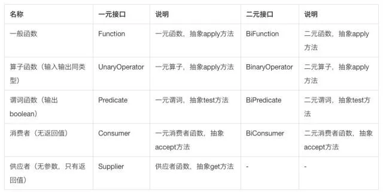

## JDK1.8新特性

### Lamdba表达式（函数式编程）
#### 用法
> ()->{}
> 方法参数   方法要实现的内容

以Lambda语法创建线程和匿名内部类创建线程的区别（显然代码少了很多！）：
``` java
    //匿名内部类
    new Thread(new Runnable() {
        @Override
        public void run() {
            System.out.println("hello");
        }
    })
    //Lambda表达式，实际就是创建出该接口的实例对象
    new Thread(()->{System.out.println("hello")});
```
* Lambda返回的是接口的实例对象

* 有没有参数、参数有多少个、需不需要有返回值、返回值的类型是什么---->选择自己合适的函数式接口


#### 函数式编程接口
> 函数接口，是指内部只有一个抽象方法的接口

JDK原生就给我们提供了一些函数式编程接口方便我们去使用，下面是一些常用的接口：


#### 方法引用
如果函数式接口的实现恰好可以通过调用一个方法来实现，那么我们可以使用方法引用

分类
* 静态方法的方法引用

* 非静态方法的方法引用

* 构造函数的方法引用

### stream
#### 是什么
Stream 使用一种类似用 SQL 语句从数据库查询数据的直观方式来提供一种对 Java 集合运算和表达的高阶抽象。

这种风格将要处理的元素集合看作一种流， 流在管道中传输， 并且可以在管道的节点上进行处理， 比如筛选， 排序，聚合等。

元素流在管道中经过中间操作（intermediate operation）的处理，最后由最终操作(terminal operation)得到前面处理的结果。
#### 为什么用
* 方便并发
* 代码量少（直接调用API）

#### 如何使用
分三步
1. 创建Stream流
2. 通过Stream流对象执行中间操作
3. 执行最终操作，得到结果

##### 创建流
``` java
/**
 * 返回的都是流对象
 * @param args
 */
public static void main(String[] args) {
    List<String> list = new ArrayList<>();
    // 从集合创建
    Stream<String> stream = list.stream();
    Stream<String> stream1 = list.parallelStream();

    // 从数组创建
    IntStream stream2 = Arrays.stream(new int[]{2, 3, 5});

    // 创建数字流
    IntStream intStream = IntStream.of(1, 2, 3);

    // 使用random创建
    IntStream limit = new Random().ints().limit(10);

}
```
##### 执行中间操作
```java
String str = "my name is 007";
Stream.of(str.split(" ")).filter(s->s.length()>2)
.map(s->s.length()).foreach(System.out::println);
```
* filter：过滤
* map：映射
* parallel：并行处理

##### 执行最终操作
懒加载，调用了最终操作的方法，Stream才会执行
最终操作和中间操作的判断根据返回值：
中间操作返回的是Stream实例对象