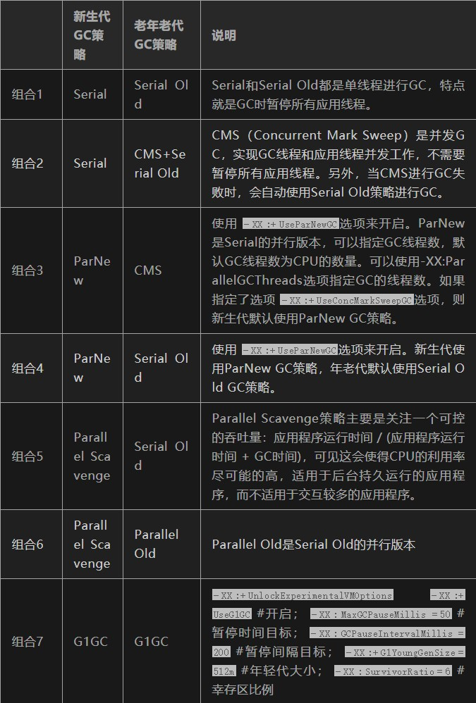

# JVM
## 内存结构

* 堆
* 元空间（方法区）
* 栈
* 本地方法栈
* 程序计数器

### 堆
对于大多数应用来说，Java堆（Java Heap）是Java虚拟机所管理的内存中最大的一块。Java堆是被所有线程共享的一块内存区域，在虚拟机启动时创建。此内存区域的唯一目的就是存放对象实例，几乎所有的对象实例都在这里分配内存。

Java堆是垃圾收集器管理的主要区域，因此很多时候也被称做“GC堆”。如果从内存回收的角度看，由于现在收集器基本都是采用的分代收集算法，所以Java堆中还可以细分为：新生代和老年代；再细致一点的有Eden空间、From Survivor空间、To Survivor空间等。

根据Java虚拟机规范的规定，Java堆可以处于物理上不连续的内存空间中，只要逻辑上是连续的即可，就像我们的磁盘空间一样。在实现时，既可以实现成固定大小的，也可以是可扩展的，不过当前主流的虚拟机都是按照可扩展来实现的（通过-Xmx和-Xms控制）。

如果在堆中没有内存完成实例分配，并且堆也无法再扩展时，将会抛出OutOfMemoryError异常。

### 方法区

方法区（Method Area）与Java堆一样，是各个线程共享的内存区域，它用于存储已被虚拟机加载的类信息、常量、静态变量、即时编译器编译后的代码等数据。虽然Java虚拟机规范把方法区描述为堆的一个逻辑部分，但是它却有一个别名叫做Non-Heap（非堆），目的应该是与Java堆区分开来。

对于习惯在HotSpot虚拟机上开发和部署程序的开发者来说，很多人愿意把方法区称为“永久代”（Permanent Generation），本质上两者并不等价，仅仅是因为HotSpot虚拟机的设计团队选择把GC分代收集扩展至方法区，或者说使用永久代来实现方法区而已。

Java虚拟机规范对这个区域的限制非常宽松，除了和Java堆一样不需要连续的内存和可以选择固定大小或者可扩展外，还可以选择不实现垃圾收集。相对而言，垃圾收集行为在这个区域是比较少出现的，但并非数据进入了方法区就如永久代的名字一样“永久”存在了。这个区域的内存回收目标主要是针对常量池的回收和对类型的卸载，一般来说这个区域的回收“成绩”比较难以令人满意，尤其是类型的卸载，条件相当苛刻，但是这部分区域的回收确实是有必要的。

根据Java虚拟机规范的规定，当方法区无法满足内存分配需求时，将抛出OutOfMemoryError异常。

方法区有时被称为持久代（PermGen）。

所有的对象在实例化后的整个运行周期内，都被存放在堆内存中。堆内存又被划分成不同的部分：伊甸区(Eden)，幸存者区域(Survivor Sapce)，老年代（Old Generation Space）。

方法的执行都是伴随着线程的。原始类型的本地变量以及引用都存放在线程栈中。而引用关联的对象比如String，都存在在堆中。

### 程序计数器

程序计数器（Program Counter Register）是一块较小的内存空间，它的作用可以看做是当前线程所执行的字节码的行号指示器。在虚拟机的概念模型里（仅是概念模型，各种虚拟机可能会通过一些更高效的方式去实现），字节码解释器工作时就是通过改变这个计数器的值来选取下一条需要执行的字节码指令，分支、循环、跳转、异常处理、线程恢复等基础功能都需要依赖这个计数器来完成。

由于Java虚拟机的多线程是通过线程轮流切换并分配处理器执行时间的方式来实现的，在任何一个确定的时刻，一个处理器（对于多核处理器来说是一个内核）只会执行一条线程中的指令。因此，为了线程切换后能恢复到正确的执行位置，每条线程都需要有一个独立的程序计数器，各条线程之间的计数器互不影响，独立存储，我们称这类内存区域为“线程私有”的内存。

如果线程正在执行的是一个Java方法，这个计数器记录的是正在执行的虚拟机字节码指令的地址；如果正在执行的是Natvie方法，这个计数器值则为空（Undefined）。

此内存区域是唯一一个在Java虚拟机规范中没有规定任何OutOfMemoryError情况的区域。

### 栈

与程序计数器一样，Java虚拟机栈（Java Virtual Machine Stacks）也是线程私有的，它的生命周期与线程相同。虚拟机栈描述的是Java方法执行的内存模型：每个方法被执行的时候都会同时创建一个栈帧（Stack Frame）用于存储局部变量表、操作栈、动态链接、方法出口等信息。每一个方法被调用直至执行完成的过程，就对应着一个栈帧在虚拟机栈中从入栈到出栈的过程。

局部变量表存放了编译期可知的各种基本数据类型（boolean、byte、char、short、int、float、long、double）、对象引用（reference类型，它不等同于对象本身，根据不同的虚拟机实现，它可能是一个指向对象起始地址的引用指针，也可能指向一个代表对象的句柄或者其他与此对象相关的位置）和returnAddress类型（指向了一条字节码指令的地址）。

其中64位长度的long和double类型的数据会占用2个局部变量空间（Slot），其余的数据类型只占用1个。局部变量表所需的内存空间在编译期间完成分配，当进入一个方法时，这个方法需要在帧中分配多大的局部变量空间是完全确定的，在方法运行期间不会改变局部变量表的大小。

在Java虚拟机规范中，对这个区域规定了两种异常状况：如果线程请求的栈深度大于虚拟机所允许的深度，将抛出StackOverflowError异常；如果虚拟机栈可以动态扩展（当前大部分的Java虚拟机都可动态扩展，只不过Java虚拟机规范中也允许固定长度的虚拟机栈），当扩展时无法申请到足够的内存时会抛出OutOfMemoryError异常。

### 本地方法栈

本地方法栈（Native Method Stacks）与虚拟机栈所发挥的作用是非常相似的，其区别不过是虚拟机栈为虚拟机执行Java方法（也就是字节码）服务，而本地方法栈则是为虚拟机使用到的Native方法服务。虚拟机规范中对本地方法栈中的方法使用的语言、使用方式与数据结构并没有强制规定，因此具体的虚拟机可以自由实现它。甚至有的虚拟机（譬如Sun HotSpot虚拟机）直接就把本地方法栈和虚拟机栈合二为一。与虚拟机栈一样，本地方法栈区域也会抛出StackOverflowError和OutOfMemoryError异常。

## OOM
### 常见的OOM

```java
//原因：对象不能被分配到堆内存中
Exception in thread “main”: java.lang.
OutOfMemoryError: Java heap space

//原因：类或者方法不能被加载到老年代。它可能出现在一个程序加载很多类的时候，比如引用了很多第三方的库；
Exception in thread “main”: java.lang.
OutOfMemoryError: PermGen space

//原因：创建的数组大于堆内存的空间
Exception in thread “main”: java.lang.
OutOfMemoryError: request array size exceeds VM limit

//原因：分配本地分配失败。JNI、本地库或者Java虚拟机都会从本地堆中分配内存空间。
Exception in thread “main”: java.lang.
OutOfMemoryError: request <size> bytes for <reason>. Out of swap space?

//原因：同样是本地方法内存分配失败，只不过是JNI或者本地方法或者Java虚拟机发现
Exception in thread “main”: java.lang.
OutOfMemoryError: <reason> <stack trace>(Native method)
```

### 溢出测试
#### 堆溢出
``` java
package jdk;

import java.util.ArrayList;
import java.util.List;
/**
 * 
 * @author 
 * VM args: -Xms20M -Xmx20M
 */
public class HeapOOM {

	public HeapOOM() {
		// TODO Auto-generated constructor stub
	}

	static class OOMObject {

	}

	public static void main(String[] args) {
		List<OOMObject> list = new ArrayList<OOMObject>();
		while (true) {
			list.add(new OOMObject());
		}
	}

}
```

#### 栈溢出

```java
package jdk;
/**
 * 
 * @author 
 * VM args: -Xss128K
 */
public class JavaVMStackSOF {

	private int stackLength = 1;

	public JavaVMStackSOF() {
		// TODO Auto-generated constructor stub
	}

	public void stackLeak() {
		stackLength++;
		stackLeak();
	}

	/**
	 * @param args
	 */
	public static void main(String[] args) {
		// TODO Auto-generated method stub
		JavaVMStackSOF oom = new JavaVMStackSOF();
		try {
			oom.stackLeak();
		} catch (Throwable e) {
			System.out.println("stack length:" + oom.stackLength);
			throw e;
		}
	}

}
```

#### 常量池溢出

``` java
package jdk;

import java.util.ArrayList;
import java.util.List;
/**
 * 
 * @author 
 * VM args: -XX:PermSize=10M -XX:MaxPermSize=10M
 */
public class RuntimeConstantPoolOOM {

	public RuntimeConstantPoolOOM() {
		// TODO Auto-generated constructor stub
	}

	/**
	 * @param args
	 */
	public static void main(String[] args) {
		// TODO Auto-generated method stub
		List<String> list = new ArrayList<String>();
		int i = 0;
		while (true) {
			list.add(String.valueOf(i++).intern());
		}
	}
}
```

#### 方法区溢出

一个cglib导致的方法区溢出的示例：借助CGLib使方法区出现内存溢出异常（在对类进行增强时，都会使用到CGLib这类字节码技术，增强的类越多，就需要越大的方法区来保证动态生成的Class可以加载入内存。

``` XML
<dependency>
          <groupId>cglib</groupId>
          <artifactId>cglib</artifactId>
          <version>3.2.6</version>
</dependency>
```

``` java
package jdk;

import java.lang.reflect.Method;

import net.sf.cglib.proxy.Enhancer;
import net.sf.cglib.proxy.MethodInterceptor;
import net.sf.cglib.proxy.MethodProxy;
/**
 * 
 * @author 
 * VM args: -XX:PermSize=10M -XX:MaxPermSize=10M
 */
public class JavaMethodAreaOOM {

	public JavaMethodAreaOOM() {
		// TODO Auto-generated constructor stub
	}

	/**
	 * @param args
	 */
	public static void main(String[] args) {
		// TODO Auto-generated method stub
		while (true) {
			Enhancer enhancer = new Enhancer();
			enhancer.setSuperclass(OOMObject.class);
			enhancer.setUseCache(false);
			enhancer.setCallback(new MethodInterceptor() {

				@Override
				public Object intercept(Object arg0, Method arg1,
						Object[] arg2, MethodProxy arg3) throws Throwable {
					// TODO Auto-generated method stub
					return arg3.invokeSuper(arg0, arg2);
				}
			});
			enhancer.create();
		}
	}

	static class OOMObject {

	}

}
```
## GC
JVM中，程序计数器、虚拟机栈、本地方法栈都是随线程而生随线程而灭，栈帧随着方法的进入和退出做入栈和出栈操作，实现了自动的内存清理，因此，我们的内存垃圾回收主要集中于 java 堆和方法区中，在程序运行期间，这部分内存的分配和使用都是动态的.

**对象存活判断**
判断对象是否存活一般有两种方式：

1. 引用计数：
   每个对象有一个引用计数属性，新增一个引用时计数加1，引用释放时计数减1，计数为0时可以回收。此方法简单，无法解决对象相互循环引用的问题。
2. 
   可达性分析（Reachability Analysis）：从GC Roots开始向下搜索，搜索所走过的路径称为引用链。当一个对象到GC Roots没有任何引用链相连时，则证明此对象是不可用的。不可达对象。

在Java语言中，GC Roots包括：
* 虚拟机栈中引用的对象。
* 方法区中类静态属性实体引用的对象。
* 方法区中常量引用的对象。
* 本地方法栈中JNI引用的对象。


### 算法

#### 标记清除
> 算法分为“标记”和“清除”两个阶段：首先标记出所有需要回收的对象，在标记完成后统一回收掉所有被标记的对象。之所以说它是最基础的收集算法，是因为后续的收集算法都是基于这种思路并对其缺点进行改进而得到的。

**缺点**：
* 效率问题，标记和清除过程的效率都不高
* 空间问题，标记清除之后会产生大量不连续的内存碎片，空间碎片太多可能会导致，当程序在以后的运行过程中需要分配较大对象时无法找到足够的连续内存而不得不提前触发另一次垃圾收集动作。

#### 复制
> 它将可用内存按容量划分为大小相等的两块，每次只使用其中的一块。当这一块的内存用完了，就将还存活着的对象复制到另外一块上面，然后再把已使用过的内存空间一次清理掉。

**缺点**
* 空间问题，一半儿的空间被搁置
* 效率问题：持续复制长生存期的对象则导致效率降低。

#### 标记整理
复制收集算法在对象存活率较高时就要执行较多的复制操作，效率将会变低。更关键的是，如果不想浪费50%的空间，就需要有额外的空间进行分配担保，以应对被使用的内存中所有对象都100%存活的极端情况，所以在老年代一般不能直接选用这种算法。

根据老年代的特点，有人提出了另外一种“标记-整理”（Mark-Compact）算法，标记过程仍然与“标记-清除”算法一样，但后续步骤不是直接对可回收对象进行清理，而是让所有存活的对象都向一端移动，然后直接清理掉端边界以外的内存

#### 分代收集

GC分代的基本假设：绝大部分对象的生命周期都非常短暂，存活时间短。

“分代收集”（Generational Collection）算法，把Java堆分为新生代和老年代，这样就可以根据各个年代的特点采用最适当的收集算法。在新生代中，每次垃圾收集时都发现有大批对象死去，只有少量存活，那就选用复制算法，只需要付出少量存活对象的复制成本就可以完成收集。而老年代中因为对象存活率高、没有额外空间对它进行分配担保，就必须使用“标记-清理”或“标记-整理”算法来进行回收。


### 垃圾回收器
> 如果说收集算法是内存回收的方法论，垃圾收集器就是内存回收的具体实现

#### Serial收集器
串行收集器是最古老，最稳定以及效率高的收集器，可能会产生较长的停顿，只使用一个线程去回收。新生代、老年代使用串行回收；新生代复制算法、老年代标记-压缩；垃圾收集的过程中会Stop The World（服务暂停）

参数控制： -XX:+UseSerialGC 串行收集器

#### ParNew收集器
ParNew收集器其实就是Serial收集器的多线程版本。新生代并行，老年代串行；新生代复制算法、老年代标记-压缩

参数控制：

-XX:+UseParNewGC ParNew收集器
-XX:ParallelGCThreads 限制线程数量

#### Parallel收集器
Parallel Scavenge收集器类似ParNew收集器，Parallel收集器更关注系统的吞吐量。可以通过参数来打开自适应调节策略，虚拟机会根据当前系统的运行情况收集性能监控信息，动态调整这些参数以提供最合适的停顿时间或最大的吞吐量；也可以通过参数控制GC的时间不大于多少毫秒或者比例；新生代复制算法、老年代标记-压缩

参数控制： -XX:+UseParallelGC 使用Parallel收集器+ 老年代串行

#### Parallel Old 收集器
Parallel Old是Parallel Scavenge收集器的老年代版本，使用多线程和“标记－整理”算法。这个收集器是在JDK 1.6中才开始提供

参数控制： -XX:+UseParallelOldGC 使用Parallel收集器+ 老年代并行

#### CMS收集器
CMS（Concurrent Mark Sweep）收集器是一种以获取最短回收停顿时间为目标的收集器。目前很大一部分的Java应用都集中在互联网站或B/S系统的服务端上，这类应用尤其重视服务的响应速度，希望系统停顿时间最短，以给用户带来较好的体验。

从名字（包含“Mark Sweep”）上就可以看出CMS收集器是基于“标记-清除”算法实现的，它的运作过程相对于前面几种收集器来说要更复杂一些，整个过程分为4个步骤，包括：
* 初始标记（CMS initial mark）
* 并发标记（CMS concurrent mark）
* 重新标记（CMS remark）
* 并发清除（CMS concurrent sweep）

其中初始标记、重新标记这两个步骤仍然需要“Stop The World”。初始标记仅仅只是标记一下GC Roots能直接关联到的对象，速度很快，并发标记阶段就是进行GC Roots Tracing的过程，而重新标记阶段则是为了修正并发标记期间，因用户程序继续运作而导致标记产生变动的那一部分对象的标记记录，这个阶段的停顿时间一般会比初始标记阶段稍长一些，但远比并发标记的时间短。

由于整个过程中耗时最长的并发标记和并发清除过程中，收集器线程都可以与用户线程一起工作，所以总体上来说，CMS收集器的内存回收过程是与用户线程一起并发地执行。老年代收集器（新生代使用ParNew）

优点: 并发收集、低停顿
缺点: 产生大量空间碎片、并发阶段会降低吞吐量

参数控制：

-XX:+UseConcMarkSweepGC 使用CMS收集器
-XX:+ UseCMSCompactAtFullCollection Full GC后，进行一次碎片整理；整理过程是独占的，会引起停顿时间变长
-XX:+CMSFullGCsBeforeCompaction 设置进行几次Full GC后，进行一次碎片整理
-XX:ParallelCMSThreads 设定CMS的线程数量（一般情况约等于可用CPU数量）

#### G1收集器
G1是目前技术发展的最前沿成果之一，HotSpot开发团队赋予它的使命是未来可以替换掉JDK1.5中发布的CMS收集器。与CMS收集器相比G1收集器有以下特点：
1. 空间整合，G1收集器采用标记整理算法，不会产生内存空间碎片。分配大对象时不会因为无法找到连续空间而提前触发下一次GC。
2. 可预测停顿，这是G1的另一大优势，降低停顿时间是G1和CMS的共同关注点，但G1除了追求低停顿外，还能建立可预测的停顿时间模型，能让使用者明确指定在一个长度为N毫秒的时间片段内，消耗在垃圾收集上的时间不得超过N毫秒，这几乎已经是实时Java（RTSJ）的垃圾收集器的特征了。

上面提到的垃圾收集器，收集的范围都是整个新生代或者老年代，而G1不再是这样。使用G1收集器时，Java堆的内存布局与其他收集器有很大差别，它将整个Java堆划分为多个大小相等的独立区域（Region），虽然还保留有新生代和老年代的概念，但新生代和老年代不再是物理隔阂了，它们都是一部分（可以不连续）Region的集合。

G1的新生代收集跟ParNew类似，当新生代占用达到一定比例的时候，开始出发收集。和CMS类似，G1收集器收集老年代对象会有短暂停顿。

收集步骤：
1、标记阶段，首先初始标记(Initial-Mark),这个阶段是停顿的(Stop the World Event)，并且会触发一次普通Mintor GC。对应GC log:GC pause (young) (inital-mark)

2、Root Region Scanning，程序运行过程中会回收survivor区(存活到老年代)，这一过程必须在young GC之前完成。

3、Concurrent Marking，在整个堆中进行并发标记(和应用程序并发执行)，此过程可能被young GC中断。在并发标记阶段，若发现区域对象中的所有对象都是垃圾，那个这个区域会被立即回收(图中打X)。同时，并发标记过程中，会计算每个区域的对象活性(区域中存活对象的比例)。

4、Remark, 再标记，会有短暂停顿(STW)。再标记阶段是用来收集 并发标记阶段 产生新的垃圾(并发阶段和应用程序一同运行)；G1中采用了比CMS更快的初始快照算法:snapshot-at-the-beginning (SATB)。

5、Copy/Clean up，多线程清除失活对象，会有STW。G1将回收区域的存活对象拷贝到新区域，清除Remember Sets，并发清空回收区域并把它返回到空闲区域链表中。

6、复制/清除过程后。回收区域的活性对象已经被集中回收到深蓝色和深绿色区域。

#### 常见的垃圾收集器组合

## JVM调优

