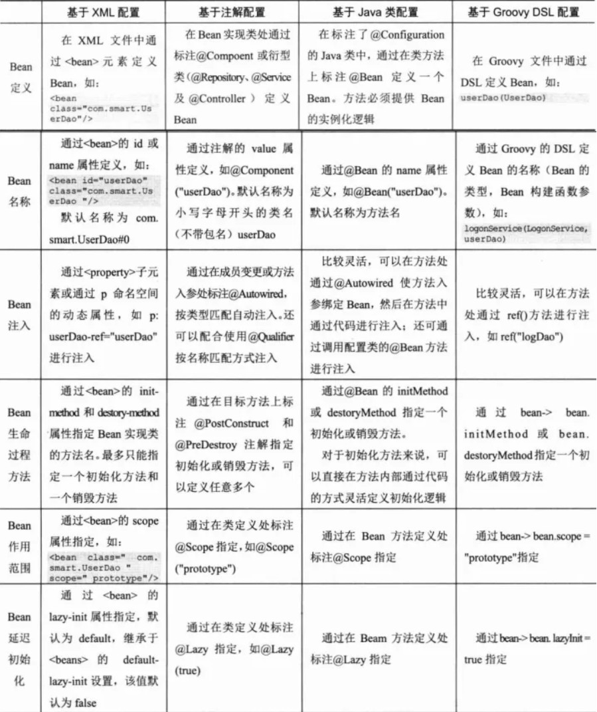

# Spring介绍
## Spring是什么

## 解决了什么问题

# IOC
> 依赖注入，控制反转；Spring IOC 解决的是对象管理和对象依赖的问题。本来我们的对象都是new出来的，而我们如果使用Spring 则把对象交给「IOC容器」来管理。

IOC容器：

> 是一个「工厂」，我们把对象都交由这个「工厂」来管理，包括对象的创建和对象之间的依赖关系等等。等我们要用到对象的时候，就从这个「工厂」里边取出来。

控制反转IOC

> 本来是「由我们自己」new出来的对象，现在交给了IOC容器。把这个对象的「控制权」给「他方」了。「控制反转」更多的是一种思想或者说是设计模式，把原有由自己掌控的事交给「别人」来处理。

依赖注入DI

> 「依赖注入」更多指的是「控制反转」这个思想的实现方式：对象无需自行创建或管理它们的依赖关系，依赖关系将被「自动注入」到需要它们的对象当中去。

## IOC&ID

### 将对象交给IOC容器

Spring提供了四种方式：

* 注解
* XML
* JavaConfig
* 基于Groovy DSL配置

以XML配置+注解来装配Bean比较多，其中注解这种方式占大部分。

理解：本来我们的对象都是「由我们自己」new出来的，现在我们把这个对象的创建权限和对象之间的依赖关系交由「IOC容器」来管理。

Spring容器(Bean工厂)可简单分成两种：

-   BeanFactory

-   -   这是最基础、面向Spring的

-   ApplicationContext

-   -   这是在BeanFactory基础之上，面向使用Spring框架的开发者。提供了一系列的功能！

几乎所有的应用场合**都是**使用ApplicationContext！

### 告诉IOC容器bean之间的依赖关系（依赖注入）

依赖关系：日常开发中其实很多时候就是A对象里边有B对象的属性而已。

**方式：**

* 构造器注入
* **属性（setting()方法）注入**
* 工厂方法注入

## 好处

1.  不用自己组装，拿来就用。
2.  享受单例的好处，效率高，不浪费空间。
3.  便于单元测试，方便切换mock组件。
4.  便于进行AOP操作，对于使用者是透明的。
5.  统一配置，便于修改。

## 原理

IOC容器其实就是一个大工厂，它用来管理我们所有的对象以及依赖关系。

-   原理就是通过Java的**反射技术**来实现的！通过反射我们可以获取类的所有信息(成员变量、类名等等等)！
-   再通过配置文件(xml)或者注解来**描述**类与类之间的关系
-   我们就可以通过这些配置信息和反射技术来**构建**出对应的对象和依赖关系了！

Spring IOC容器是怎么实现对象的创建和依赖的：

1.  根据Bean配置信息在容器内部创建Bean定义注册表
2.  根据注册表加载、实例化bean、建立Bean与Bean之间的依赖关系
3.  将这些准备就绪的Bean放到Map缓存池中，等待应用程序调用

# Bean

##### 作用域

-   单例Singleton

-   多例prototype

-   与Web应用环境相关的Bean作用域（需要手动配置）

-   -   reqeust
    -   session

##### 生命周期

* Bean 容器找到配置文件中 Spring Bean 的定义。
* Bean 容器利用 Java Reflection API 创建一个Bean的实例。
* 如果涉及到一些属性值 利用 set()方法设置一些属性值。
* 如果 Bean 实现了 BeanNameAware 接口，调用 setBeanName()方法，传入Bean的名字。
* 如果 Bean 实现了 BeanClassLoaderAware 接口，调用 setBeanClassLoader()方法，传入 ClassLoader对象的实例。
* 与上面的类似，如果实现了其他 *.Aware接口，就调用相应的方法。
* 如果有和加载这个 Bean 的 Spring 容器相关的 BeanPostProcessor 对象，执行postProcessBeforeInitialization() 方法
* 如果Bean实现了InitializingBean接口，执行afterPropertiesSet()方法。
* 如果 Bean 在配置文件中的定义包含 init-method 属性，执行指定的方法。
* 如果有和加载这个 Bean的 Spring 容器相关的 BeanPostProcessor 对象，执行postProcessAfterInitialization() 方法
* 当要销毁 Bean 的时候，如果 Bean 实现了 DisposableBean 接口，执行 destroy() 方法。
* 当要销毁 Bean 的时候，如果 Bean 在配置文件中的定义包含 destroy-method 属性，执行指定的方法。

##### 实际应用
日常开发中，我们很多时候用@Component注解标识将对象放到「IOC容器」中，用@Autowired注解将对象注入

下面这张图就很好总结了以各种方式来对Bean的定义和注入。

##### 多线程问题

>    Spring用的ThreadLocal

我们知道在一般情况下，只有无状态的Bean才可以在多线程环境下共享，在Spring中，绝大部分Bean都可以声明为singleton作用域。就是因为Spring对一些Bean（如RequestContextHolder、**TransactionSynchronizationManager**、LocaleContextHolder等）中非线程安全状态的“状态性对象”采用ThreadLocal封装，让它们也成为线程安全的“状态性对象”，因此，有状态的Bean就能够以singleton的方式在多线程中工作。

# AOP

### 是什么
AOP：Aspect Object Programming  「面向切面编程」
Spring AOP主要做的事情就是：「把重复的代码抽取，在运行的时候往业务方法上动态植入“切面类代码”」
**底层技术：动态代理**

Spring事务基于Spring AOP，Spring AOP底层用的动态代理，动态代理有两种方式：

* 基于接口代理(JDK代理)
    * 基于接口代理，凡是类的方法非public修饰，或者用了static关键字修饰，那这些方法都不能被Spring AOP增强
    * 推荐多例（JDK在创建代理对象时的性能要高于CGLib代理）
* 基于CGLib代理(子类代理)
    * 基于子类代理，凡是类的方法使用了private、static、final修饰，那这些方法都不能被Spring AOP增强
    * 推荐单例（JDK生成代理对象的运行性能却比CGLib的低。）

### 术语

**连接点**(Join point)：

-   **能够被拦截的地方**：Spring AOP是基于动态代理的，所以是方法拦截的。每个成员方法都可以称之为连接点~

**切点**(Poincut)：

-   **具体定位的连接点**：上面也说了，每个方法都可以称之为连接点，我们**具体定位到某一个方法就成为切点**。

**增强/通知**(Advice)：

-   表示添加到切点的一段**逻辑代码**，并定位连接点的**方位信息**。

-   -   简单来说就定义了是干什么的，具体是在哪干
    -   Spring AOP提供了5种Advice类型给我们：前置、后置、返回、异常、环绕给我们使用！

**织入**(Weaving)：

-   将`增强/通知`添加到目标类的具体连接点上的过程。

**引入/引介**(Introduction)：

-   `引入/引介`允许我们**向现有的类添加新方法或属性**。是一种**特殊**的增强！

**切面**(Aspect)：

-   切面由切点和`增强/通知`组成，它既包括了横切逻辑的定义、也包括了连接点的定义。

### JDK动态代理实现AOP

### Spring AOP

# 事务

## 原理
> Spring事务的本质就是数据库对事务的支持，使用Spring管理事务后，coding时可以省略对事务的操作，通过AOP将操作在代理类中加上，关键切片类->TransactionAspectSupport

## 什么时候回滚

>   所拦截的方法有指定异常抛出，事务自动回滚；默认情况下，事务只对Error与RuntimeException及其子类有效，如果一般的Exception想回滚，需要配置rollbackFor=Exception.Class

## 什么时候失效

##### 发生自调用

*   同一个Service中，未被事务管理的函数调用被事务管理的函数，本质是本类this调用而不是代理类，无法通过AOP增强

##### 方法修饰符不是public

*   private不符合逻辑，被事务管理的函数不被调用毫无意义
*   其他修饰符不会被事务管理

##### 发生了错误的异常

*   被捕获的异常
*   非RuntimeExecption未加上rollbackFor

##### 数据库不支持事务

>   Spring事务用的是数据库的事务，如果Spring不支持事务，Spring事务肯定不会生效。

## 事务隔离

>   Spring事务隔离在MySQL事务隔离的基础上抽象了一种默认隔离级别，表示数据库默认的隔离级别

*   MySQL配置的隔离级别与Spring配置的隔离级别冲突时，以Spring配置为准
*   Spring配置的隔离级别MySQL不支持时，以MySQL为准

## 事务传播机制

> 在当前含有事务方法内部调用其他的方法(无论该方法是否含有事务)

##### PROPAGATION_REQUIRED

>   支持当前事务，如果当前没有事务，就新建一个事务

比如说，ServiceB.methodB的事务级别定义为PROPAGATION_REQUIRED, 那么由于执行ServiceA.methodA的时候，
ServiceA.methodA已经起了事务，这时调用ServiceB.methodB，ServiceB.methodB看到自己已经运行在ServiceA.methodA
的事务内部，就不再起新的事务。而假如ServiceA.methodA运行的时候发现自己没有在事务中，他就会为自己分配一个事务。
这样，在ServiceA.methodA或者在ServiceB.methodB内的任何地方出现异常，事务都会被回滚。即使ServiceB.methodB的事务已经被
提交，但是ServiceA.methodA在接下来fail要回滚，ServiceB.methodB也要回滚

##### PROPAGATION_REQUIRES_NEW

>   新建事务，如果当前存在事务，把当前事务挂起，执行当前新建事务完成以后，上下文事务恢复再执行。

## 可能出现的情况
### 第一种
在Service层抛出Exception，在Controller层捕获，那如果在Service中有异常，那会事务回滚吗？

如果是编译时异常不会自动回滚，如果是运行时异常，那会自动回滚！
### 第二种
带有@Transactional注解所包围的方法就能被Spring事务管理起来，那如果我在当前类下使用一个没有事务的方法去调用一个有事务的方法，那我们这次调用会怎么样？是否会有事务呢？

Spring会自动生成代理对象

显然地，我们拿到的是代理(Proxy)对象，调用`addEmployee2Controller()`方法，而`addEmployee2Controller()`方法的逻辑是`target.addEmployee()`，调用回原始对象(target)的`addEmployee()`。所以这次的调用**压根就没有事务存在**，更谈不上说Spring事务传播机制了。

